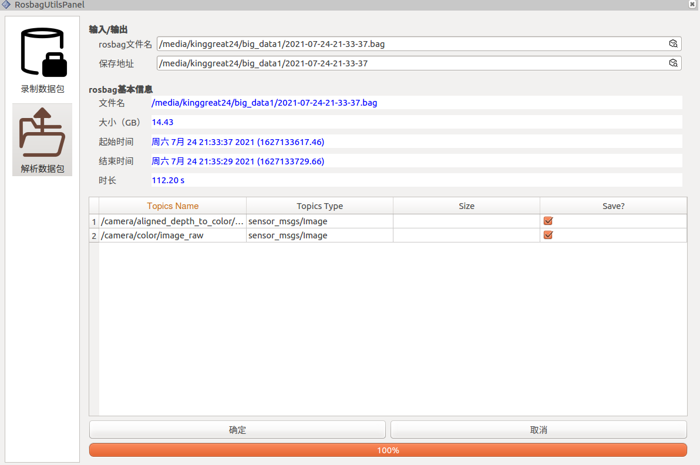
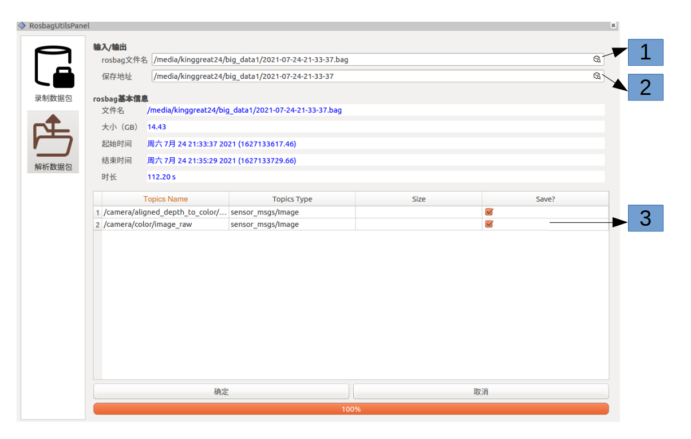

## 1. Introduction

The package is used for convert rosbag to Separate files. 




## 2. Usage

### 1. Add rosbag gui pannel

```
Pannels -> Add New Pannel -> RosbagUtilsPanel
```

### 2. Serialize rosbag



1. Select **rosbag** file, then wait for loading
2. Set file save path.
3. Select topics